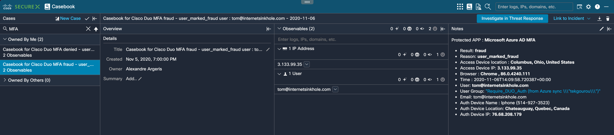
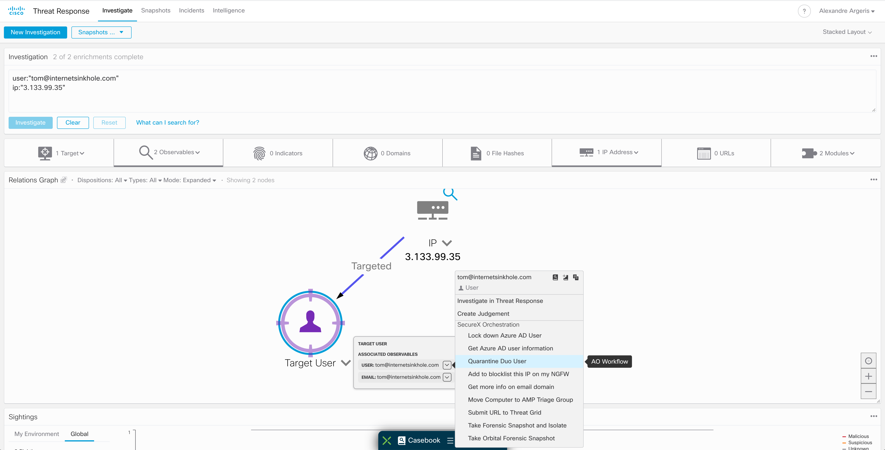
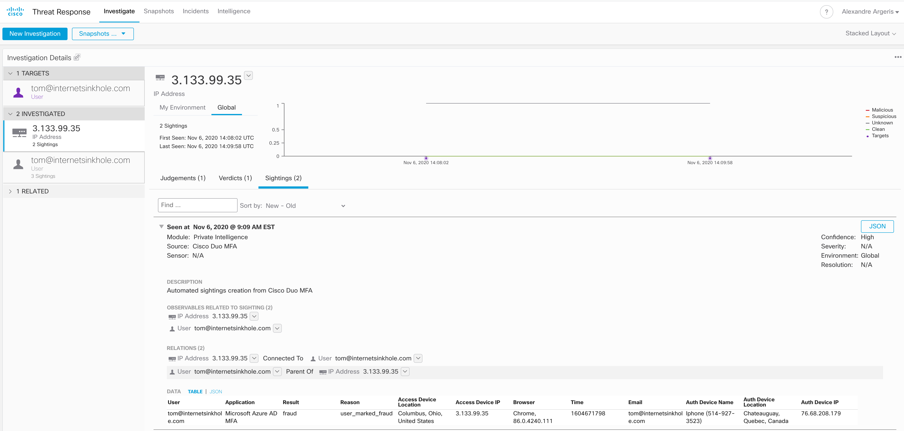

## Duo SecureX Orchestration workflows

Create SecureX Casebook and Sigthings based on Duo Auth logs.

 

 

 
# Prerequisites:

1. Create an Admin API application in Duo and save the credentials.

2. Copy these credentials into Cisco SecureX Orchestration variable section:

- Admin Integration Key (iKey), Host as a string variables [duo_admin_ikey], [duo_host]
- Admin Secret Key (sKey) as a Secure string variable [duo_admin_skey]

3. Create the Duo Target based on the hostname in the Cisco SecureX Orchestration. 

  - Give a name, like "Duo"
  - No account keys: True
  - HTTPS protocol, host/IP address: API hostname
  - Proxy: Ignore Proxy
  
4. Use this "Duo" target in the workflows selecting "Override workflow target" option and "Duo" target.

# Import these workflows into SecureX Orchestration as atomic workflows:
  
# 1. CTRGenerateAccessToken.json

  This Atomic workflow action will get CTR access token.

# 2. CTR Create Casebook.json 

  This Atomic workflow actions will create Casebook.  
  
# 3. Duo Admin - Get DENIED or FRAUD Auth Logs.json

  This Atomic workflow action will fetch Duo auth denied and fraud logs.

# You can use these workflows:

# Remediation workflows

# 1. Duo Admin - Block User By Username.json  

  This Atomics workflow action block a Duo user based on username. (Work only if the Duo user is local - not sync with Azure AD or Win AD)

# 2. Quarantine Duo User.json
  This workflow give you access to quarantine user in Duo from the SecureX AO contextuel menu.
  
# 3. Azure AD - lockdown user

# For any question please reach out to me at alexandre@argeris.net or aargeris@cisco.com
